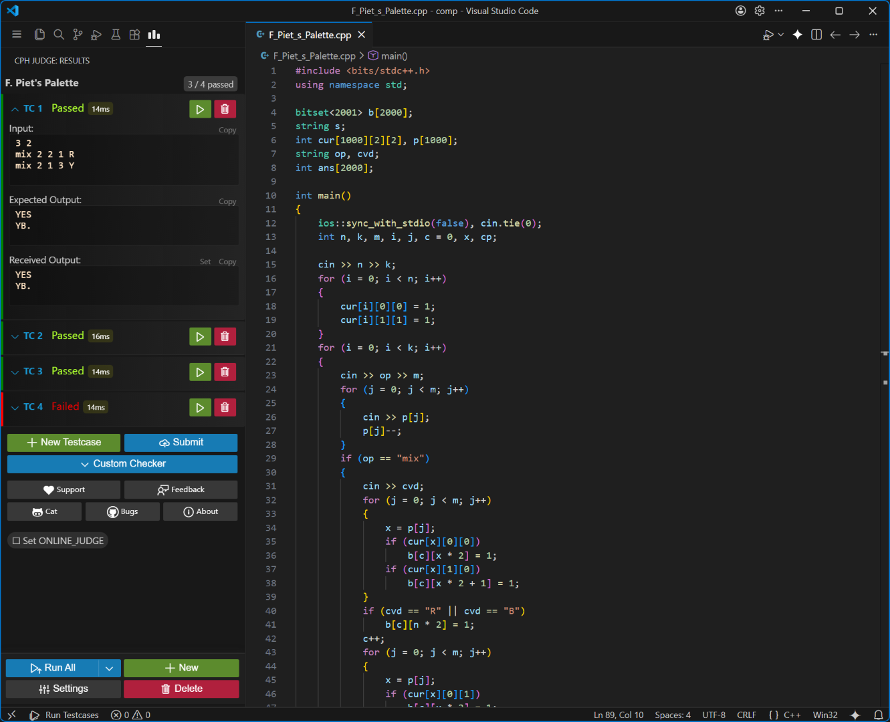

# Competitive Programming Helper Plus

[中文说明](README_cn.md)


> [!WARNING]
>
> **This fork cannot coexist with the original CPH extension.** It keeps the
> same extension identifier and `cph.*` settings for compatibility, so
> installing it replaces the original Competitive Programming Helper. Back up
> any settings you want to keep before switching.

Quickly compile, run and judge competitive programming problems in VS Code.
Automatically download testcases , or write & test your own problems. Once you
are done, easily submit your solutions directly with the click of a button!

Cph supports a large number of popular platforms like Codeforces, Codechef,
TopCoder etc. with the help of competitive companion browser extension



## Fork additions

This repository is a modified version of
[Competitive Programming Helper](https://github.com/agrawal-d/competitive-programming-helper).
Besides the upstream workflow, it adds configurable problem-file organization
and VJudge support:

-   Filename templates with OJ-specific overrides and automatic directory
    creation.
-   Configurable OJ hostname mappings to extract OJ, contest, and problem IDs.
-   VJudge URL reconstruction, so imported VJudge problems use their original OJ
    metadata for naming and submission.
-   Optional VJudge page in VS Code's integrated browser, opened beside the
    source.
-   An option to store all generated `.cph` metadata under the workspace root.

See the [Chinese README](README_cn.md) for configuration examples and the
complete description of these additions.

## Quick start

1. Build and install this fork as a VSIX:
    ```sh
    npm ci
    npm run vscode:prepublish
    npx @vscode/vsce package
    ```
    Then use VS Code's **Extensions: Install from VSIX...** command and open a
    folder.
1. [Install competitive companion](https://github.com/jmerle/competitive-companion#readme)
   in your browser.
1. Use Companion by pressing the green plus (+) circle from the browser toolbar
   when visiting any problem page.
1. The file opens in VS Code with testcases preloaded. Press
   <kbd>Ctrl</kbd>+<kbd>Alt</kbd>+<kbd>B</kbd> to run them.

-   (Optional) Install the [cph-submit](https://github.com/agrawal-d/cph-submit)
    browser extension to enable submitting directly on CodeForces.
-   (Optional) Install submit client and config file from the
    [Kattis help page](https://open.kattis.com/help/submit) after logging in.

You can also use this extension locally, just open any supported file and press
'Run Testcases' (or <kbd>Ctrl</kbd>+<kbd>Alt</kbd>+<kbd>B</kbd>) to manually
enter testcases.

[](docs/user-guide.md)

## Features

-   Automatic compilation with display for compilation errors.
-   Intelligent judge with support for signals, timeouts and runtime errors.
-   Works with Competitive Companion.
-   [Codeforces auto-submit](https://github.com/agrawal-d/cph-submit)
    integration.
-   [Kattis auto-submit](docs/user-guide.md) integration.
-   **Custom Checker (Special Judge)**: Use Python scripts to evaluate problems
    with multiple valid outputs or specific precision requirements.
-   Works locally for your own problems.
-   Support for several languages.

## Supported Languages

-   C++
-   C
-   C#
-   Rust
-   Go
-   Haskell
-   Python
-   Ruby
-   Java
-   JavaScript (Node.js)
-   Cangjie

Interested in adding support for another language? Check out the
[developer guide](docs/dev-guide.md#adding-support-for-a-new-language).

## Supported Display Languages

-   English
-   Chinese (Simplified)
-   Korean
-   Japanese

Interested in adding a new translation? See the
[translation guide](docs/dev-guide.md#adding-a-new-translation).

## Contributing

You can contribute to this extension in many ways:

-   File bug reports by creating issues.
-   Develop this extension further - see [developer guide](docs/dev-guide.md).
-   Spreading the word about this extension.

**Before creating a Pull Request, please create an issue to discuss the
approach. It makes reviewing and accepting the PR much easier.**

## Telemetry

To show live user count, the extension sends a request to the server every few
seconds. No information is sent with the request.

## License

Copyright (C) 2019 - Present Divyanshu Agrawal

This program is free software: you can redistribute it and/or modify it under
the terms of the GNU General Public License as published by the Free Software
Foundation, either version 3 of the License, or (at your option) any later
version.

This program is distributed in the hope that it will be useful, but WITHOUT ANY
WARRANTY; without even the implied warranty of MERCHANTABILITY or FITNESS FOR A
PARTICULAR PURPOSE. See the GNU General Public License for more details.

You should have received a copy of the GNU General Public License along with
this program. If not, see https://www.gnu.org/licenses/.
