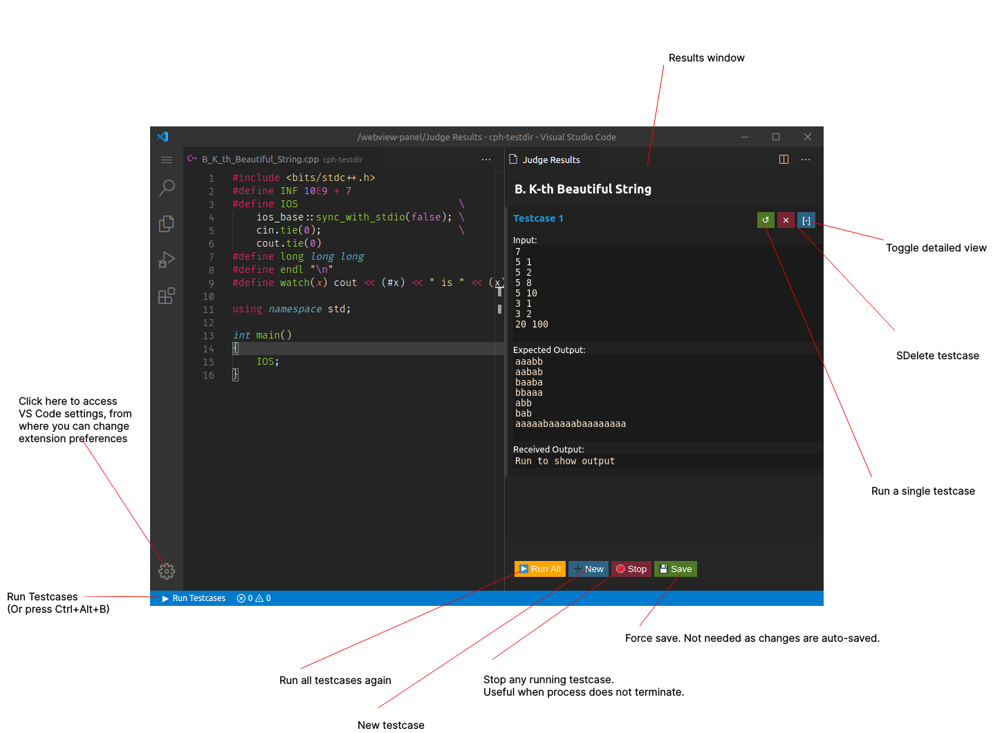
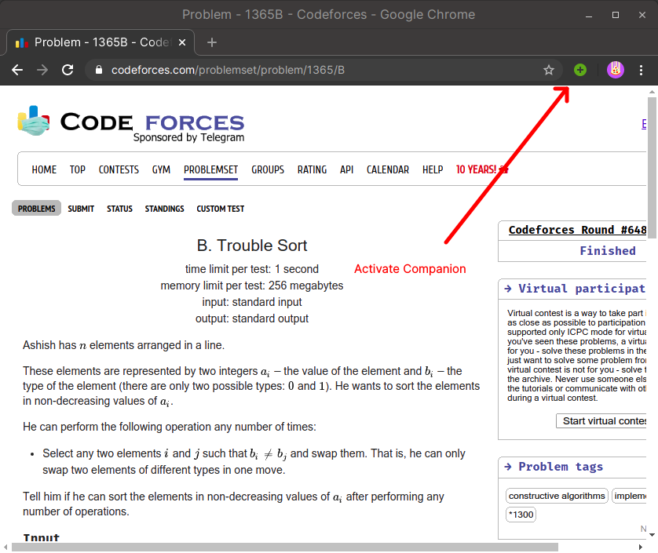
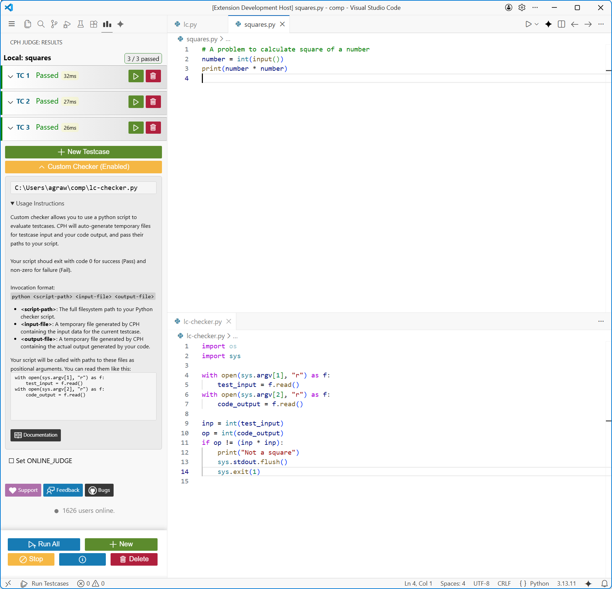
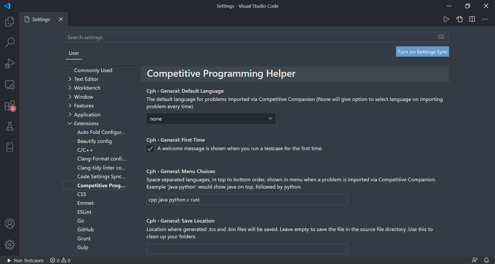
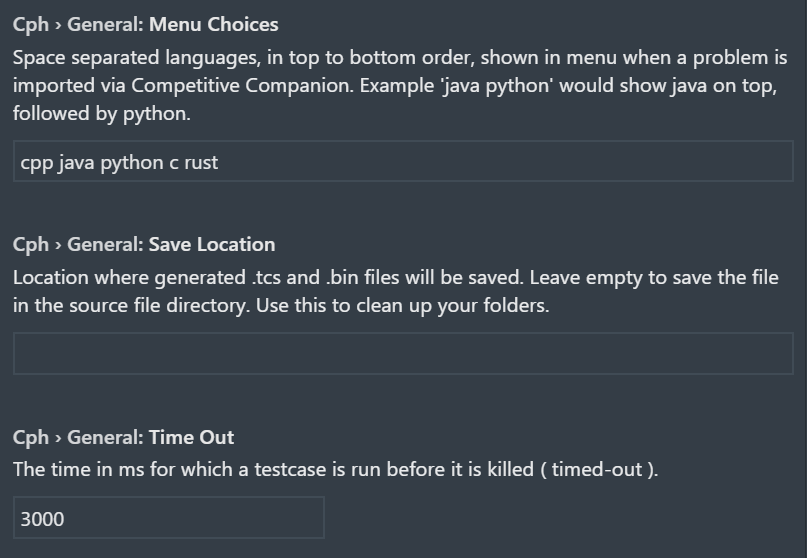
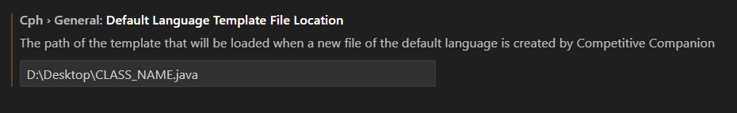
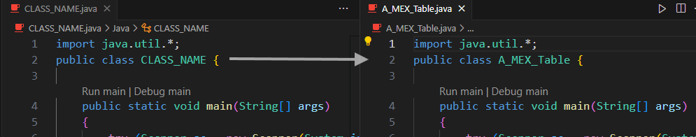
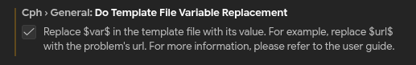
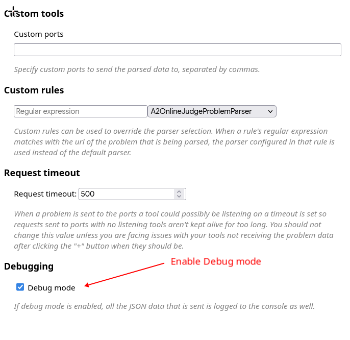
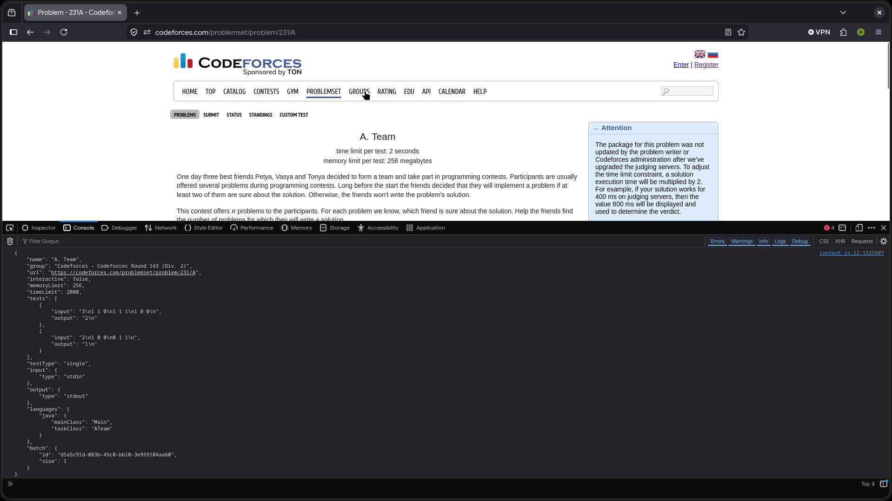

# CPH Plus 用户指南

本文介绍如何使用 Competitive Programming Helper Plus（CPH Plus）。

[English](user-guide.md) · 中文

## 界面说明



上图是旧版界面，请以 README 和扩展中的实际界面为准；各按钮的功能保持一致。

## 配合 Competitive Companion 使用

1. 按本项目 README 的说明安装 CPH Plus。
2. 在浏览器中安装 [Competitive Companion](https://github.com/jmerle/competitive-companion#readme)。
3. 在 VS Code 中打开任意文件夹（**文件 → 打开文件夹**）。
4. 打开题目网页后，点击浏览器工具栏中 Competitive Companion 的绿色加号按钮。

    

5. 源文件会在 VS Code 中打开并预加载样例。按 `Ctrl+Alt+B` 运行全部样例，或从活动栏底部的 **Run Testcases** 按钮启动。

## 使用自己的题目

1. 使用受支持的语言编写代码，例如 `.cpp`、`.c`、`.rs`、`.py`。
2. 按 `Ctrl+Alt+B`，或点击活动栏底部的 **Run Testcases**。
3. 在右侧打开的 CPH 面板中填写测试用例。
4. 运行单个测试点或运行全部测试点。

## 提交到 Codeforces

1. 在 Firefox 中安装 [cph-submit](https://github.com/agrawal-d/cph-submit)。
2. 安装后保持一个浏览器窗口打开。
3. 在结果窗口中点击 **Submit to CF**。
4. 浏览器会打开一个页面并提交题目。

## 提交到 Kattis

1. 下载 Kattis 的[配置文件](https://open.kattis.com/download/kattisrc)和[提交客户端](https://github.com/Kattis/kattis-cli)，并确保已在浏览器中登录 Kattis。
2. 将这些文件放入主目录下名为 `.kattisrc` 的目录：

    1. macOS：通常为 `/Users/{用户名}/.kattisrc`
    2. Linux：通常为 `/home/{用户名}/.kattisrc`
    3. Windows：通常为 `C:\Users\{用户名}\.kattisrc`

3. 若出现错误，请在终端运行以下命令确认 `~` 指向的目录：

    ```bash
    python -c "import os; print(os.path.expanduser('~'))"
    ```

4. 在结果窗口中点击 **Submit to Kattis**。
5. 浏览器会打开提交页面。

## 自定义 Checker（特殊判题）



CPH Plus 提供 **Custom Checker**（也称 **Special Judge / SPJ**）功能，适用于：

- 有多种合法输出的题目，例如“输出任意一条路径”；
- 浮点数比较需要特定精度；
- 普通“完全一致”比较无法完成验证的复杂题目。

### 工作方式

启用自定义 Checker 后，CPH Plus 不再使用内置比较逻辑，而是将判定交给你的脚本。

1. 点击判题视图中的 **Custom Checker** 打开配置区。
2. 填入 Python 脚本的**绝对路径**，例如 `/home/user/checker.py` 或 `C:\scripts\judge.py`。
3. 启用后，所有测试点的“预期输出”会隐藏，因为它不再参与判定。
4. 点击 **Custom Checker (Enabled)** 可快速聚焦路径输入框。

### 执行细节

每个正常运行完成的测试点都会独立执行一次 Checker。

- **语言**：目前仅支持 Python 脚本；CPH Plus 使用设置中配置的 Python 命令运行它。
- **数据传递**：输入与程序输出通过临时文件传递，而非标准输入，以避免大数据受 shell 缓冲区限制。
- **临时文件**：每次运行会在系统临时目录创建两个随机命名文件，Checker 结束后会自动删除：
  - `cph-input-[random].txt`：测试点原始输入；
  - `cph-output-[random].txt`：你的程序实际输出。
- **调用格式**：`python <脚本路径> <输入文件> <输出文件>`。
  1. `argv[0]`：Checker 脚本路径；
  2. `argv[1]`：CPH Plus 生成的输入文件；
  3. `argv[2]`：CPH Plus 生成的输出文件。

### 判定逻辑与结果

- **通过/失败**：仅由脚本的退出码决定：
  - 退出码 `0`：测试点通过；
  - 非零退出码：测试点失败。
- **Checker 日志**：脚本写入 `STDOUT` 或 `STDERR` 的内容会被 CPH Plus 捕获。展开单个测试点的 **Checker Log** 即可查看，便于排查失败原因。

### 推荐示例脚本

```python
import sys

def judge():
    try:
        # 参数 1：测试点输入文件
        with open(sys.argv[1], "r") as f:
            test_input = f.read().strip()

        # 参数 2：程序实际输出文件
        with open(sys.argv[2], "r") as f:
            code_output = f.read().strip()

        # --- 在这里编写判题逻辑 ---
        # 示例：检查输出是否为输入的平方
        val = int(test_input)
        ans = int(code_output)

        if ans == val * val:
            print("Correct: Output matches expected square.")
            sys.exit(0)  # 通过
        else:
            print(f"Error: Expected {val * val}, got {ans}")
            sys.exit(1)  # 失败

    except Exception as e:
        print(f"Checker Error: {e}")
        sys.exit(1)  # 脚本出错时判为失败

if __name__ == "__main__":
    judge()
```

### 最佳实践

- 始终填写 Checker 的绝对路径，避免路径歧义。
- 在脚本中使用 `print()` 输出调试信息；它会显示在 CPH Plus 的 **Checker Log** 中。
- 使用 `try-except` 包裹逻辑，确保错误能被记录而非静默退出。
- 显式调用 `sys.exit(0)` 或 `sys.exit(1)`；某些环境即使逻辑错误也可能默认返回 `0`。

## 环境

- 对 C++，CPH Plus 会定义 `DEBUG` 与 `CPH` 宏。

## 自定义设置

在 VS Code 左下角齿轮中打开设置，进入 `competitive-programming-helper` 分类即可配置扩展。



### 通用设置



- 生成元数据的默认保存位置；
- 通过 Competitive Companion 导入新题目时的默认语言；
- 导入新题目时菜单中可选的语言；
- 测试点超时时间。

### 各语言设置

- 额外编译参数；
- Codeforces 提交时下拉菜单中使用的编译器（需要 [cph-submit](#提交到-codeforces)）；
- Python 文件使用的命令，例如 `py`、`python3`、`pypy3`。

## 默认语言模板

- Competitive Companion 新建默认语言文件时加载的模板路径。
- Java 模板中类名应写作 `CLASS_NAME`；新文件创建时它会自动替换为文件名。
- 可在模板中放置 `$CURSOR_PLACEHOLDER`。创建文件后，光标会自动定位到这里，且该占位符会被移除。

 

### 模板变量替换

通过 Competitive Companion 创建文件时，可以将 `$var$` 替换为对应值。例如：

- `$name$`：题目名称；
- `$url$`：题目链接；
- `$date$`：本地日期，格式 `YYYY-MM-DD`；
- `$time$`：本地时间，格式 `HH:MM:SS`。

完整变量列表：在 Competitive Companion 设置中打开调试模式（右键扩展 → 管理扩展 → 首选项），激活题目后按 `F12` 打开开发者工具，并在 Console 中查看 JSON 键。





## 获取帮助

如遇到问题、发现 Bug 或希望提出功能建议，请在[本项目 Issues](https://github.com/KevinHuangIsLearning/competitive-programming-helper-plus/issues) 中反馈。
